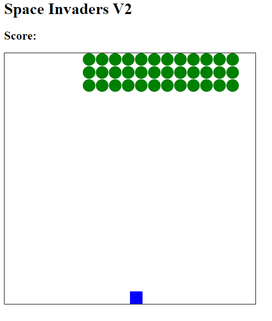

Space Invaders V2
=================

Using 'canvas' in html for a grid version as canvas of course is already a grid!

Object oriented javascript code

Little green men 'Aliens' move down the board and speed increases each time they hit the wall and move 1 line down. So watch out!! it gets super fast!

Choice betweed wsad for player control or right/left arrow.

Keeps score
If aliens overtake player base displays 'you loose' but still shows your score

Lots of super funcationality in this version - so much easier, faster and better.

Canvas wins!!

Enjoy :)

